<div align="center">


<h1>Platform Chaos Engineering</h1>

<p><strong>The Enterprise Reliability Accelerator for Controlled Failure Injection & Resilience Validation.</strong></p>

[]()
[]()
[]()

<br/>

> **"Hope is not a strategy. Controlled failure is."** 
> **Platform Chaos Engineering** is a production-safe experimentation framework designed to uncover systemic weaknesses before they turn into outages. It validates your system's self-healing mechanisms by injecting precise, controlled faults—from network latency to pod terminations.

</div>

---

## 🏛️ Executive Summary

In a modern distributed system, failure is inevitable. Whether it's a regional cloud outage, a database deadlock, or a simple network partition, your system will break. Organizations often fail because they wait for failure to happen in production rather than proactively practicing it in a controlled environment.

This platform provides the **Resilience Control Plane**. It implements a complete **Chaos Engineering Lifecycle Framework**, enabling SRE and Engineering teams to manage resilience as a first-class citizen. By automating the injection of faults and orchestrating real-time safety guardrails, we ensure that every organizational service—from monoliths to microservices—is born resilient, audited for failure modes, and improved through scientific experimentation.

---

## 📐 Architecture Storytelling: Principal Reference Models

### 1. Principal Architecture: Global Chaos Engineering & Resilience Orchestration Plane
This diagram illustrates the end-to-end flow from experiment hypothesis and planning to failure injection, steady-state monitoring, automated rollback, and institutional auditing.

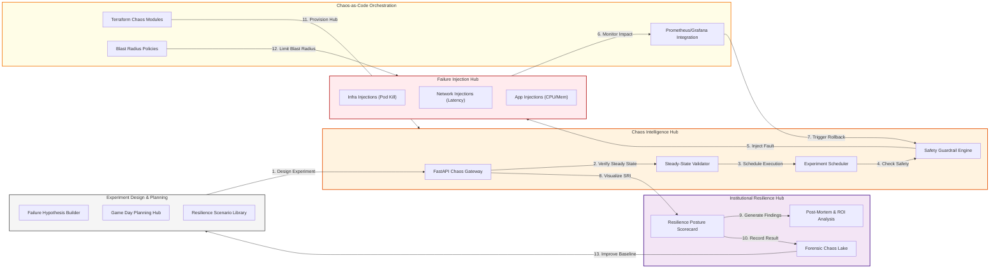

### 2. The Chaos Experiment Lifecycle Flow
The continuous path of a failure hypothesis from initial design and planning to active injection, analysis, and institutional improvement.

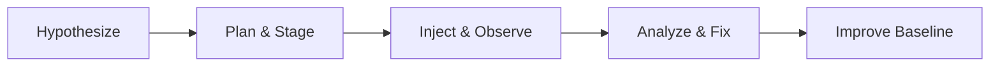

### 3. Blast Radius & Guardrail Orchestration
Strategic containment of failure injections to ensure that experiments never impact production customers or global system availability.

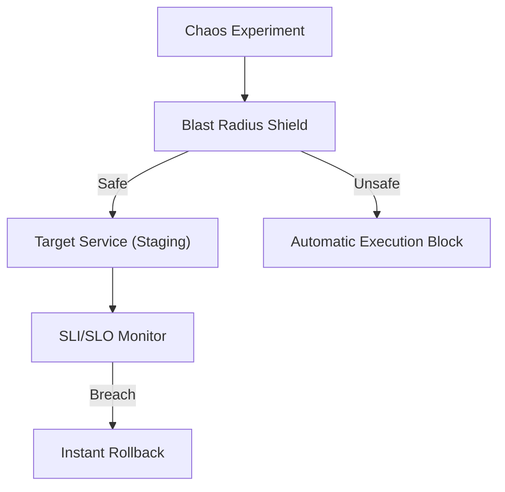

### 4. Failure Injection Hub (Infrastructure/App/Network)
A unified interface for orchestrating diverse failure modes, including pod terminations, network latency, disk I/O throttling, and application resource exhaustion.

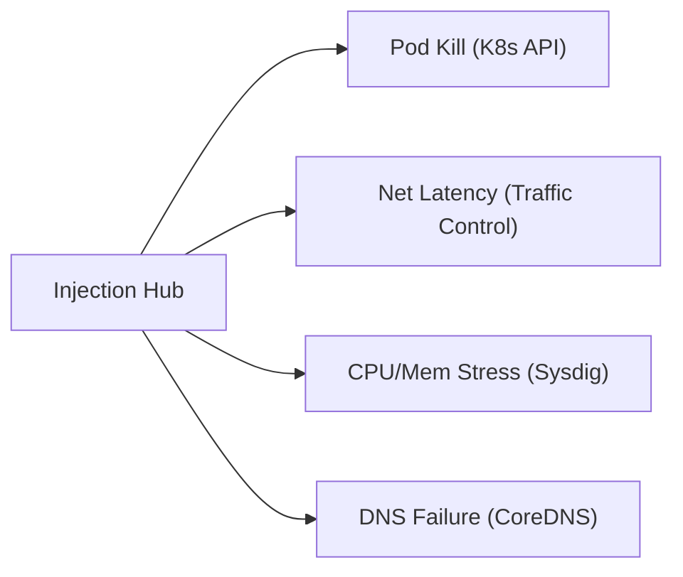

### 5. Steady State Verification Flow
Continuous monitoring of System Level Indicators (SLIs) before, during, and after experiments to confirm that the system remains within acceptable bounds.

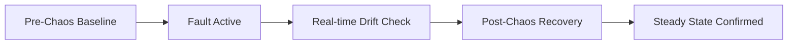

### 6. Game Day & Incident Simulation Hub
Coordinating cross-functional teams through orchestrated failure scenarios to practice incident response and validate platform resilience.

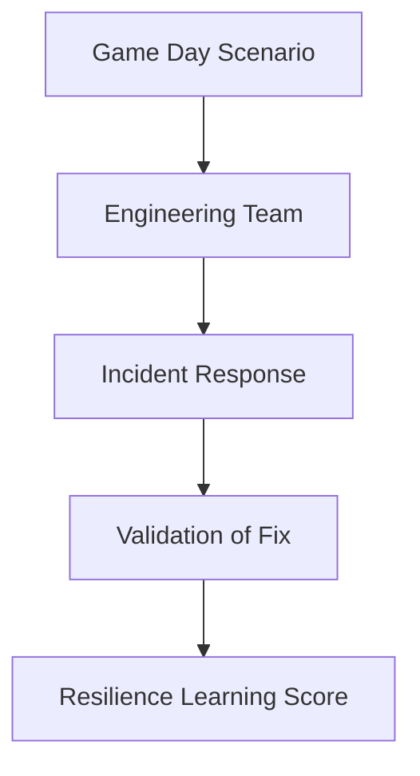

### 7. Institutional Resilience Scorecard
Grading organizational services on key performance indicators: System Resilience Index (SRI), Recovery Velocity, and Hypothesis Provenance.

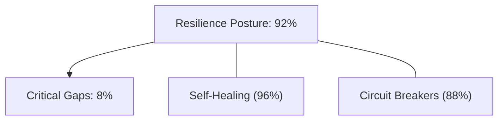

### 8. Identity & RBAC for Chaos Ops
Managing fine-grained access to experiment definitions, injection triggers, and safety controls between Chaos Engineers and Service Owners.

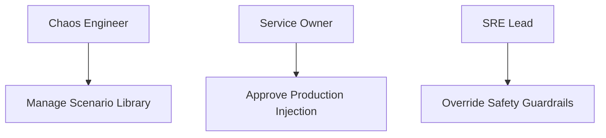

### 9. Automated Chaos in CI/CD (Resilience Gates)
Implementing automated failure tests within the software delivery pipeline to ensure that new code meets institutional resilience standards before release.

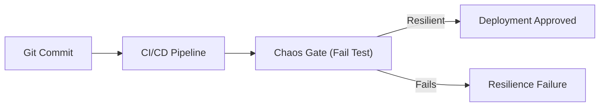

### 10. IaC Deployment: Chaos-as-Code Framework
Using Terraform to deploy and manage the versioned distribution of the chaos engine, injection workers, and observability integration.

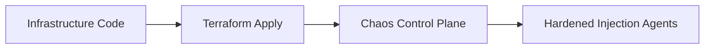

### 11. Metadata Lake for Forensic Chaos Audit
Storing long-term records of every failure hypothesis, injection event, and remediation finding for institutional investigation and compliance.

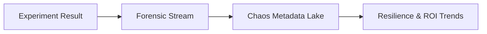

---

## 🏛️ Core Resilience Pillars

1.  **Hypothesis-Driven Engineering**: Treating reliability as a scientific discipline with clear, testable expectations.
2.  **Automated Safety Guardrails**: Hard-coded limits that instantly stop and revert experiments if critical SLOs degrade.
3.  **Blast Radius Containment**: Ensuring that experimentation never compromises the availability of unrelated services.
4.  **Steady-State Monitoring**: Using high-fidelity metrics to verify system health before, during, and after failure.
5.  **Multi-Mode Injections**: Supporting diverse failure scenarios across Infrastructure, Network, and Applications.
6.  **Full Auditability**: Immutable recording of every experiment and finding for institutional record-keeping.

---

## 🛠️ Technical Stack & Implementation

### Chaos Engine & APIs
*   **Framework**: Python 3.11+ / FastAPI.
*   **Chaos Core**: Custom injection engine with native Kubernetes API and Traffic Control (TC) integration.
*   **Safety Hub**: Real-time SLO validator that monitors Prometheus/Grafana signals during active experiments.
*   **Orchestrator**: Queue-based scheduler for managing the execution and rollback of complex failure scenarios.
*   **State Management**: PostgreSQL (Metadata Lake) and Redis (Execution Cache).

### Chaos Dashboard (UI)
*   **Framework**: React 18 / Vite.
*   **Theme**: Dark, Rose, Amber (Dynamic, alert-driven aesthetic).
*   **Visualization**: Recharts for SRI (System Resilience Index) tracking and experiment progression.

### Infrastructure & DevOps
*   **Runtime**: AWS EKS or Azure Kubernetes Service (AKS).
*   **Tooling**: Integrated with Chaos Mesh (simulated) and LitmusChaos primitives.
*   **IaC**: Modular Terraform for deploying the chaos hub and injection agent distributions.

---

## 🏗️ IaC Mapping (Module Structure)

| Module | Purpose | Real Services |
| :--- | :--- | :--- |
| **`infrastructure/chaos_hub`** | Central management plane | EKS, PostgreSQL, Redis |
| **`infrastructure/workers`** | Hardened injection agents | DaemonSets, Sidecars, Lambda |
| **`infrastructure/safety`** | SLO monitoring & rollbacks | Prometheus, Alertmanager |
| **`infrastructure/auditing`** | Forensic chaos sinks | S3, Athena, Quicksight |

---

## 🚀 Deployment Guide

### Local Principal Environment
```bash
# Clone the chaos platform
git clone https://github.com/devopstrio/platform-chaos-engineering.git
cd platform-chaos-engineering

# Configure environment
cp .env.example .env

# Launch the Chaos stack
make up

# Run a mock failure injection simulation
make simulate-chaos
```

Access the Chaos Dashboard at `http://localhost:3000`.

---

## 📜 License
Distributed under the MIT License. See `LICENSE` for more information.

---
<div align="center">
  <p>© 2026 Devopstrio. All rights reserved.</p>
</div>
