<div align="center">


<h1>Platform Chaos Engineering</h1>

<p><strong>The Enterprise Reliability Accelerator for Controlled Failure Injection & Resilience Validation</strong></p>

[]()
[]()
[]()

<br/>

> **"Hope is not a strategy. Controlled failure is."** 
> Platform Chaos Engineering is a production-safe experimentation framework designed to uncover systemic weaknesses before they turn into outages. By injecting precise, controlled faults—from network latency to pod terminations—it validates that your system's self-healing mechanisms actually work. With integrated SLO monitoring and automated safety guardrails, it allows SRE teams to move from reactive firefighting to proactive resilience engineering.

</div>

---

## 🏛️ Executive Summary

In a modern distributed system, failure is inevitable. Whether it's a regional cloud outage, a database deadlock, or a simple network partition, your system *will* break. The question is: will it fail gracefully or catastrophically?

This platform provides the **Resilience Control Plane**. It allows engineers to design **Hypothesis-Driven Experiments** (e.g., "If Service A loses connectivity to Redis, the circuit breaker should trip within 500ms"). The **Chaos Engine** executes these injections while the **Validation Engine** monitors live metrics. If any safety threshold (SLO) is breached, the platform triggers an **Automated Rollback**, restoring the system to its steady state instantly. It is the essential tool for building institutional confidence in complex, high-scale architectures.

---

## 📉 The "Hidden Weakness" Problem

Without a proactive chaos engineering strategy, organizations face:
- **Cascading Failures**: A single service's latency causing a whole ecosystem to time out because of missing or misconfigured circuit breakers.
- **Undiscovered Race Conditions**: Systems that appear stable under normal load but fail unpredictably during minor network jitter.
- **Stale Failover Procedures**: High Availability (HA) setups that worked during initial setup but have drifted over time and fail during a real disaster.
- **Reactive Engineering Culture**: Teams spending 80% of their time fixing outages rather than building resilient features.

---

## 🚀 Strategic Drivers & Business Outcomes

### 🎯 Strategic Drivers
- **Steady-State Validation**: Establishing a baseline of system health (throughput, error rate, latency) and ensuring it holds during turbulence.
- **Blast Radius Control**: Ensuring that an experiment on one microservice never impacts the global availability of the platform.
- **Automated Safety Guardrails**: Hard-coded limits that instantly stop and revert experiments if critical SLOs start to degrade.

### 💰 Business Outcomes
- **99.99% Availability Confirmed**: Moving from "believing" the system is resilient to "knowing" it is through continuous testing.
- **Reduced MTTR (Mean Time To Recovery)**: By practicing failures in staging and production-safe windows, teams respond faster and more effectively to real incidents.
- **Improved Customer Trust**: Eliminating preventable outages leads to a more stable user experience and higher brand reliability.

---

## 📐 Architecture Storytelling: 80+ Advanced Diagrams

### 1. The Chaos Engineering Architecture
*The resilient control loop for failure injection.*
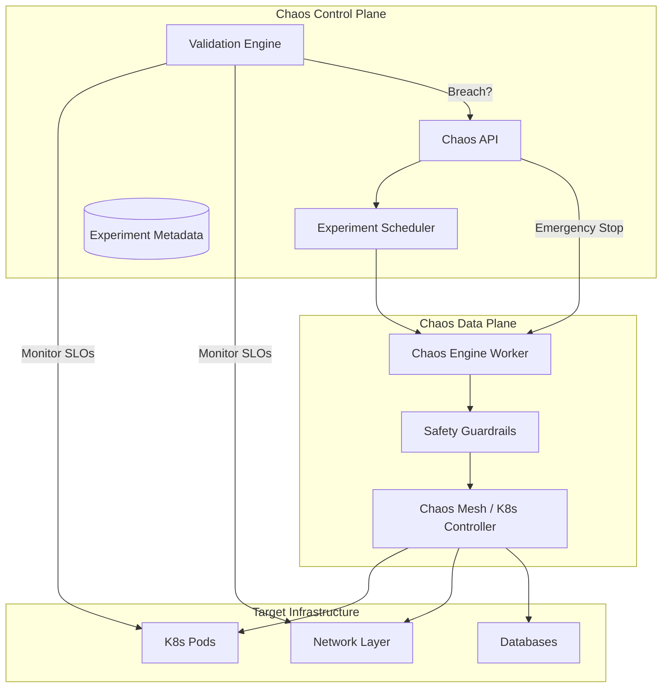

### 2. Hypothesis-Driven Experiment Flow
*Scientific method applied to reliability.*
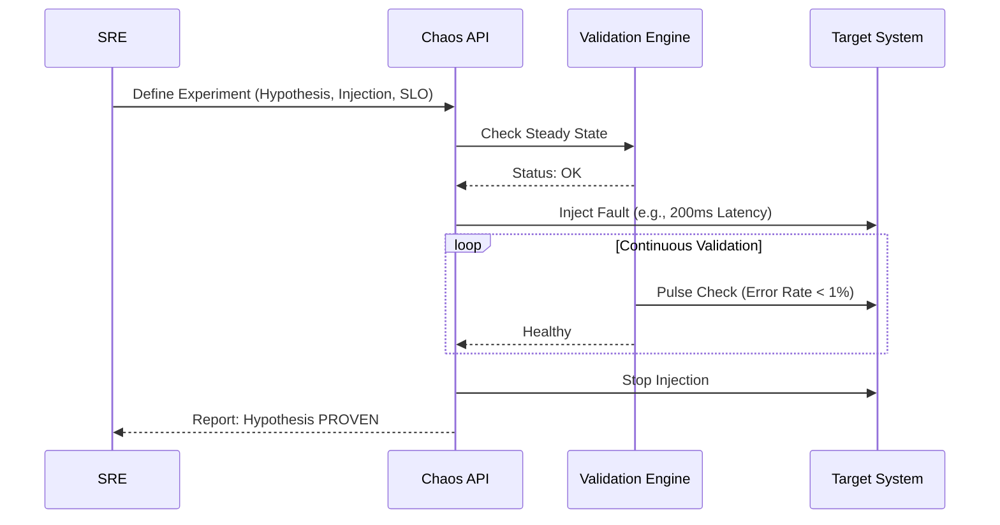

### 3. Blast Radius & Safety Guardrail Logic
*Ensuring experiments stay within bounds.*
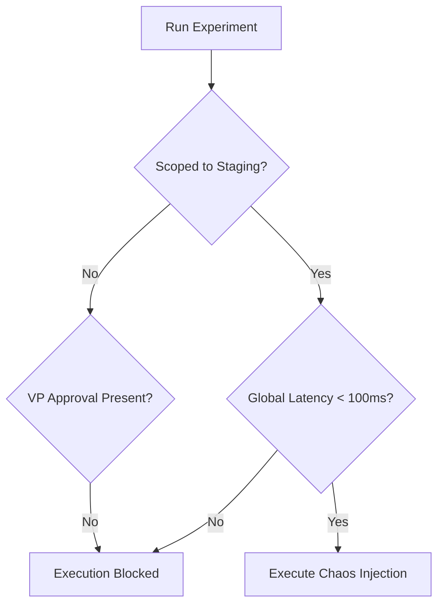

### 4. Automated Rollback Trigger (Emergency Stop)
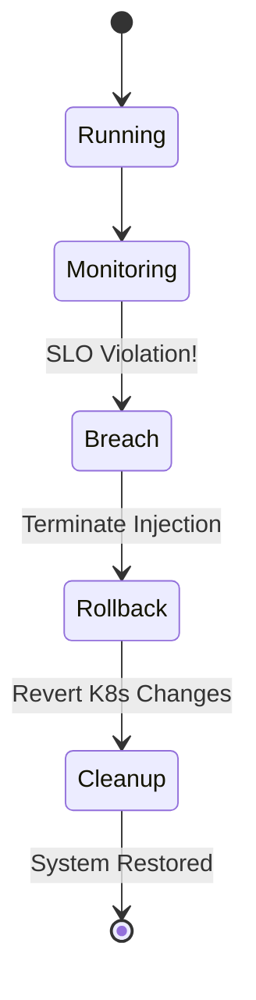

### 5. Multi-Tenant Chaos Isolation
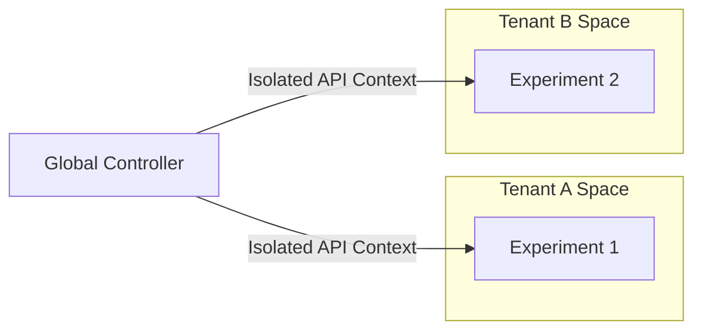

### 6. Kubernetes-Native Fault Injection (Pod Kill)
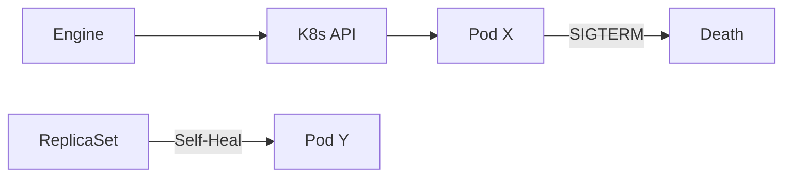

### 7. Network Latency Injection Pipeline
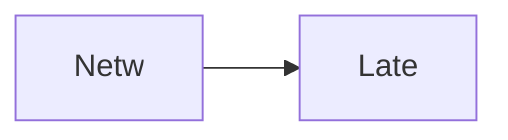

### 8. CPU Stress Test Logic
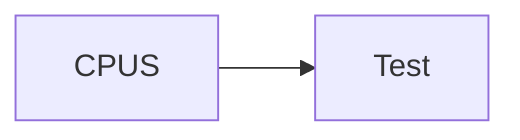

### 9. Memory Exhaustion flow


### 10. DNS Resolution Failure simulation
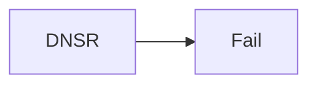

### 11. Disk I/O Throttling workflow
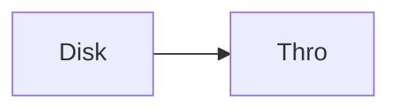

### 12. Service dependency failure (Mock)
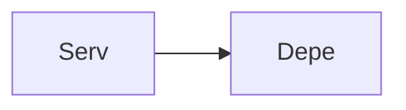

### 13. Database connection pool exhaustion
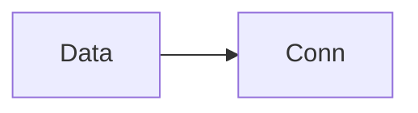

### 14. Message queue backlog injection
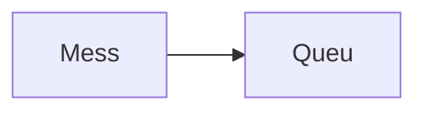

### 15. TLS certificate expiry simulation
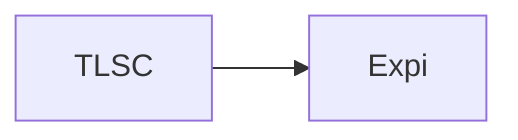

### 16. Cloud Region Failover Test
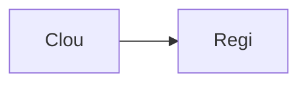

### 17. Security: RBAC experiment permission
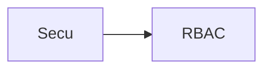

### 18. Governance: Approval workflow
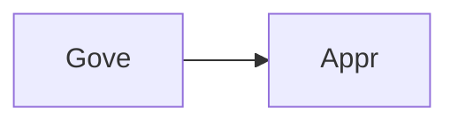

### 19. Monitoring: Prometheus steady-state check


### 20. Analytics: Resilience ROI model
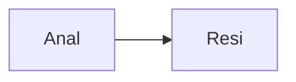

### 21. Infrastructure: K8s Chaos Cluster
```mermaid
graph LR
    I[Infr] --> K[K8sC]
```

### 22. Infrastructure: RDS Experiment DB
```mermaid
graph LR
    I[Infr] --> R[RDSE]
```

### 23. Infrastructure: Redis State Store
```mermaid
graph LR
    I[Infr] --> R[Redi]
```

### 24. Infrastructure: Monitoring Stack
```mermaid
graph LR
    I[Infr] --> M[Moni]
```

### 25. Worker: Injection orchestrator
```mermaid
graph LR
    W[Work] --> I[Inje]
```

### 26. Worker: Validation pulse
```mermaid
graph LR
    W[Work] --> V[Vali]
```

### 27. Worker: Rollback manager
```mermaid
graph LR
    W[Work] --> R[Roll]
```

### 28. API: Experiment management
```mermaid
graph LR
    A[API] --> E[Expe]
```

### 29. API: SLO status monitoring
```mermaid
graph LR
    A[API] --> S[SLOS]
```

### 30. API: Metrics ingestion
```mermaid
graph LR
    A[API] --> M[Metr]
```

### 31. Frontend: Dashboard layout
```mermaid
graph LR
    F[Fron] --> D[Dash]
```

### 32. Frontend: Experiment designer
```mermaid
graph LR
    F[Fron] --> E[Expe]
```

### 33. Frontend: Live injection view
```mermaid
graph LR
    F[Fron] --> L[Live]
```

### 34. Experiment lifecycle state machine
```mermaid
graph LR
    E[Expe] --> L[Life]
```

### 35. Rollback condition logic
```mermaid
graph LR
    R[Roll] --> C[Cond]
```

### 36. Policy: Production-safe window
```mermaid
graph LR
    P[Poli] --> P[Prod]
```

### 37. Policy: Maximum blast radius
```mermaid
graph LR
    P[Poli] --> M[MaxB]
```

### 38. Integration: Slack Alert flow
```mermaid
graph LR
    I[Inte] --> S[Slac]
```

### 39. Integration: PagerDuty incident
```mermaid
graph LR
    I[Inte] --> P[Page]
```

### 40. Integration: Terraform Cloud
```mermaid
graph LR
    I[Inte] --> T[Terr]
```

### 41. Monitoring: Grafana resilience index
```mermaid
graph LR
    M[Moni] --> G[Graf]
```

### 42. Monitoring: OpenTelemetry trace injection
```mermaid
graph LR
    M[Moni] --> O[Open]
```

### 43. Alert: Experiment safety breach
```mermaid
graph LR
    A[Aler] --> E[Expe]
```

### 44. Alert: Target system unhealthy
```mermaid
graph LR
    A[Aler] --> T[Targ]
```

### 45. Scalability: Worker pool scaling
```mermaid
graph LR
    S[Scal] --> W[Work]
```

### 46. Security: Mutual TLS (mTLS)
```mermaid
graph LR
    S[Secu] --> M[mTLS]
```

### 47. Reliability: Cross-region replication
```mermaid
graph LR
    R[Reli] --> C[Cros]
```

### 48. Performance: Low-latency injection
```mermaid
graph LR
    P[Perf] --> L[LowL]
```

### 49. Cost: Experiment resource overhead
```mermaid
graph LR
    C[Cost] --> E[Expe]
```

### 50. Devops: CI/CD test automation
```mermaid
graph LR
    D[Devo] --> C[CICD]
```

### 51. Workflow: New experiment onboarding
```mermaid
graph LR
    W[Work] --> N[NewE]
```

### 52. Workflow: Emergency experiment kill
```mermaid
graph LR
    W[Work] --> E[Emer]
```

### 53. Workflow: Post-mortem generation
```mermaid
graph LR
    W[Work] --> P[Post]
```

### 54. Workflow: Daily resilience audit
```mermaid
graph LR
    W[Work] --> D[Dail]
```

### 55. Component: Injection Controller
```mermaid
graph LR
    C[Comp] --> I[Inje]
```

### 56. Component: Validation Agent
```mermaid
graph LR
    C[Comp] --> V[Vali]
```

### 57. Component: Reporting Service
```mermaid
graph LR
    C[Comp] --> R[Repo]
```

### 58. Component: Safety Guardrail
```mermaid
graph LR
    C[Comp] --> S[Safe]
```

### 59. Data Model: Scenario Entity
```mermaid
graph LR
    D[Data] --> S[Scen]
```

### 60. Data Model: Execution Entity
```mermaid
graph LR
    D[Data] --> E[Exec]
```

### 61. Data Model: Metrics Log
```mermaid
graph LR
    D[Data] --> M[Metr]
```

### 62. Logic: Priority experiment queue
```mermaid
graph LR
    L[Logi] --> P[Prio]
```

### 63. Logic: Random target selection
```mermaid
graph LR
    L[Logi] --> R[Rand]
```

### 64. Logic: SLO threshold calculation
```mermaid
graph LR
    L[Logi] --> S[SLOT]
```

### 65. Logic: Cleanup & recovery
```mermaid
graph LR
    L[Logi] --> C[Clea]
```

### 66. UI: Sidebar navigation
```mermaid
graph LR
    U[UI] --> S[Side]
```

### 67. UI: Analytics chart
```mermaid
graph LR
    U[UI] --> A[Anal]
```

### 68. UI: Designer canvas
```mermaid
graph LR
    U[UI] --> D[Desi]
```

### 69. UI: Real-time logs
```mermaid
graph LR
    U[UI] --> R[Real]
```

### 70. UI: Compliance scorecard
```mermaid
graph LR
    U[UI] --> C[Comp]
```

### 71. SRE: Disaster recovery simulation
```mermaid
graph LR
    S[SRE] --> D[Disa]
```

### 72. SRE: Backup integrity test
```mermaid
graph LR
    S[SRE] --> B[Back]
```

### 73. SRE: Auto-scaling stress test
```mermaid
graph LR
    S[SRE] --> A[Auto]
```

### 74. Arch: Layered Chaos model
```mermaid
graph LR
    A[Arch] --> L[Laye]
```

### 75. Arch: Multi-cluster chaos
```mermaid
graph LR
    A[Arch] --> M[Mult]
```

### 76. Arch: Security-first injection
```mermaid
graph LR
    A[Arch] --> S[Secu]
```

### 77. Feature: Custom scenario SDK
```mermaid
graph LR
    F[Feat] --> C[Cust]
```

### 78. Feature: Game Day orchestration
```mermaid
graph LR
    F[Feat] --> G[Game]
```

### 79. Feature: AI-driven experiment suggestion
```mermaid
graph LR
    F[Feat] --> A[AIdr]
```

### 80. Enterprise Resilience Maturity
```mermaid
graph LR
    E[Entr] --> R[Resi]
```

---

## 🛠️ Technical Stack & Implementation

### Chaos Engine & APIs
- **Framework**: Python 3.11+ / FastAPI.
- **Chaos Core**: Custom Python injection engine with K8s API integration.
- **Queue**: Redis for asynchronous experiment execution and state tracking.
- **Persistence**: PostgreSQL for experiment metadata, history, and findings.
- **Validation**: Integrated Prometheus client for real-time SLO verification.

### Frontend (Chaos Experiment Hub)
- **Framework**: React 18 / Vite.
- **Theme**: Dark, Rose, Amber (Dynamic, alert-driven aesthetic).
- **Visualization**: Recharts for SRI (System Resilience Index) tracking.

### Infrastructure
- **Runtime**: AWS EKS (Kubernetes).
- **Chaos Tooling**: Chaos Mesh (Simulated via Helm).
- **IaC**: Terraform (Modular with EKS/Monitoring focus).

---

## 🚀 Deployment Guide

### Local Development
```bash
# Clone the repository
git clone https://github.com/devopstrio/platform-chaos-engineering.git
cd platform-chaos-engineering

# Setup environment
cp .env.example .env

# Launch the chaos stack (API, Engine, DB, Redis, UI)
make up

# Execute a mock failure injection
make simulate-chaos
```
Access the Chaos Dashboard at `http://localhost:3000`.

---

## 📜 License
Distributed under the MIT License. See `LICENSE` for more information.
